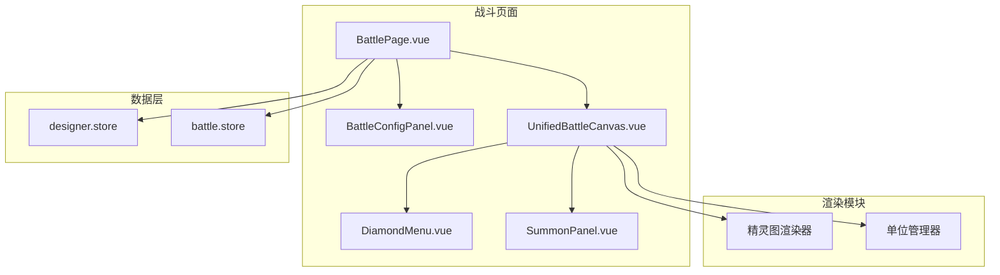

# 设计文档

## 概述

本设计文档描述完善回合制战斗系统的技术方案，包括角色精灵图渲染、亮色主题统一、菜单功能实现、数据联动等核心功能。系统基于现有的 UnifiedBattleCanvas 组件进行扩展和优化。

### 技术选型

| 领域     | 技术方案              | 说明                     |
| -------- | --------------------- | ------------------------ |
| 渲染引擎 | Canvas 2D             | 轻量级，适合 2D 战斗场景 |
| 组件框架 | Vue 3 Composition API | 响应式数据绑定           |
| 状态管理 | Pinia                 | 管理战斗状态和设计器数据 |
| 样式方案 | Tailwind CSS v4       | 原子化 CSS，亮色主题     |

## 架构

### 组件结构图



### 目录结构

```
src/modules/battle/
├── components/
│   ├── UnifiedBattleCanvas.vue    # 统一战斗画布（扩展）
│   ├── DiamondMenu.vue            # 菱形菜单（优化）
│   ├── BattleConfigPanel.vue      # 战斗配置面板（新增）
│   └── SummonPanel.vue            # 招将面板（新增）
├── composables/
│   ├── useCanvasRenderer.ts       # Canvas 渲染（扩展精灵图）
│   ├── useBattleFlow.ts           # 战斗流程控制（新增）
│   ├── useTargetSelection.ts      # 目标选择逻辑（新增）
│   └── useCharacterConverter.ts   # 角色数据转换（新增）
├── pages/
│   └── BattlePage.vue             # 战斗页面（重构）
└── utils/
    └── randomStats.ts             # 随机数值生成（新增）
```

## 组件与接口

### 核心类型扩展

```typescript
/** 扩展的战斗单位（包含精灵图渲染信息） */
interface BattleUnitExtended extends BattleUnit {
  /** 精灵图配置（来自设计工坊） */
  spriteConfig?: SpriteConfig;
  /** 动画配置列表 */
  animations?: AnimationConfig[];
  /** 当前动画帧索引 */
  currentFrame?: number;
  /** 是否处于防御状态 */
  isDefending?: boolean;
}

/** 战斗配置 */
interface BattleSetupConfig {
  /** 我方角色数量 */
  playerCount: number;
  /** 敌方角色数量 */
  enemyCount: number;
}

/** 随机数值范围配置 */
interface StatsRange {
  hp: { min: number; max: number };
  mp: { min: number; max: number };
  speed: { min: number; max: number };
  attack: { min: number; max: number };
  defense: { min: number; max: number };
  luck: { min: number; max: number };
}

/** 目标选择状态 */
interface TargetSelectionState {
  /** 是否处于目标选择模式 */
  isSelecting: boolean;
  /** 选择类型（攻击/技能） */
  selectionType: "attack" | "skill" | null;
  /** 可选择的目标 ID 列表 */
  selectableTargets: string[];
  /** 当前选中的目标 ID */
  selectedTargetId: string | null;
}

/** 战斗流程状态 */
interface BattleFlowState {
  /** 当前阶段 */
  phase: "config" | "command" | "execute" | "result";
  /** 当前回合数 */
  currentTurn: number;
  /** 当前操作角色索引 */
  currentActorIndex: number;
  /** 操作倒计时（秒） */
  commandTimer: number;
  /** 行动队列 */
  actionQueue: BattleAction[];
}
```

### 角色数据转换器

```typescript
/**
 * 将设计工坊的 CharacterConfig 转换为战斗用的 BattleUnitExtended
 * Requirements: 7.4, 7.5
 */
function convertCharacterToBattleUnit(
  character: CharacterConfig,
  isPlayer: boolean,
  statsRange: StatsRange,
): BattleUnitExtended {
  const stats = generateRandomStats(statsRange);

  return {
    id: `${isPlayer ? "player" : "enemy"}_${character.id}_${Date.now()}`,
    name: character.name,
    hp: stats.hp,
    maxHp: stats.hp,
    mp: stats.mp,
    maxMp: stats.mp,
    speed: stats.speed,
    isDead: false,
    selectable: true,
    // 保留精灵图和动画配置
    spriteConfig: character.sprite,
    animations: character.animations,
    currentFrame: 0,
    isDefending: false,
  };
}

/**
 * 生成随机战斗数值
 * Requirements: 8.6, 8.7
 */
function generateRandomStats(range: StatsRange): UnitStats {
  return {
    hp: randomInRange(range.hp.min, range.hp.max),
    maxHp: 0, // 将在生成后设置
    mp: randomInRange(range.mp.min, range.mp.max),
    maxMp: 0,
    speed: randomInRange(range.speed.min, range.speed.max),
    luck: randomInRange(1, 20),
    attack: randomInRange(range.attack.min, range.attack.max),
    defense: randomInRange(range.defense.min, range.defense.max),
  };
}
```

### 战斗配置面板组件

```typescript
/** BattleConfigPanel Props */
interface BattleConfigPanelProps {
  /** 可用角色列表 */
  availableCharacters: CharacterConfig[];
  /** 最大角色数量 */
  maxCount?: number;
}

/** BattleConfigPanel Emits */
interface BattleConfigPanelEmits {
  /** 开始战斗事件 */
  (e: "start", config: BattleSetupConfig): void;
}
```

### 招将面板组件

```typescript
/** SummonPanel Props */
interface SummonPanelProps {
  /** 可召唤的角色列表 */
  characters: CharacterConfig[];
  /** 当前我方单位数量 */
  currentPlayerCount: number;
  /** 最大单位数量 */
  maxCount?: number;
  /** 是否显示 */
  visible: boolean;
}

/** SummonPanel Emits */
interface SummonPanelEmits {
  /** 选择角色事件 */
  (e: "select", character: CharacterConfig): void;
  /** 关闭面板事件 */
  (e: "close"): void;
}
```

## 数据模型

### 默认数值范围

```typescript
const DEFAULT_STATS_RANGE: StatsRange = {
  hp: { min: 80, max: 200 },
  mp: { min: 30, max: 100 },
  speed: { min: 10, max: 30 },
  attack: { min: 10, max: 50 },
  defense: { min: 5, max: 30 },
  luck: { min: 1, max: 20 },
};
```

### 默认角色数据（当设计工坊为空时使用）

```typescript
const DEFAULT_CHARACTERS: CharacterConfig[] = [
  {
    id: "default_warrior",
    name: "战士",
    sprite: { url: "", rows: 1, cols: 1 },
    animations: [],
  },
  {
    id: "default_mage",
    name: "法师",
    sprite: { url: "", rows: 1, cols: 1 },
    animations: [],
  },
  {
    id: "default_healer",
    name: "牧师",
    sprite: { url: "", rows: 1, cols: 1 },
    animations: [],
  },
  {
    id: "default_rogue",
    name: "盗贼",
    sprite: { url: "", rows: 1, cols: 1 },
    animations: [],
  },
];
```

### 亮色主题配色

```typescript
const LIGHT_THEME = {
  // 背景色
  background: "#f8fafc", // slate-50
  canvasBackground: "#e2e8f0", // slate-200

  // 文字色
  textPrimary: "#1e293b", // slate-800
  textSecondary: "#64748b", // slate-500

  // 头部信息栏
  headerBackground: "#ffffff",
  headerBorder: "#e2e8f0",

  // 单位信息条
  hpBarColor: "#ef4444", // red-500
  hpBarLowColor: "#dc2626", // red-600
  mpBarColor: "#3b82f6", // blue-500

  // 选中效果
  activeHighlight: "#fbbf24", // amber-400
  targetHighlight: "#ef4444", // red-500
};
```

## 正确性属性

_正确性属性是系统应当满足的形式化规范，用于验证实现的正确性。每个属性都是一个普遍量化的陈述，描述了在所有有效输入下系统应有的行为。_

### Property 1: 数据加载一致性

_For any_ 设计工坊中的角色列表，战斗界面加载后使用的角色数据应与设计工坊中的数据一致（名称、精灵图配置、动画配置）。

**Validates: Requirements 1.1, 7.1, 7.2**

### Property 2: 数据转换完整性

_For any_ CharacterConfig 对象，转换为 BattleUnitExtended 后应保留原始的 name、spriteConfig 和 animations 字段。

**Validates: Requirements 7.4, 7.5**

### Property 3: 角色数量范围限制

_For any_ 战斗配置，我方和敌方角色数量应在 1-6 的范围内（包含边界值）。

**Validates: Requirements 8.2, 8.3**

### Property 4: 随机数值范围正确性

_For any_ 生成的角色战斗数值，HP 应在 80-200 范围内，攻击应在 10-50 范围内，速度应在 10-30 范围内。

**Validates: Requirements 8.6, 8.7**

### Property 5: 攻击行动记录正确性

_For any_ 攻击目标选择操作，选择目标后应生成包含正确 actorId 和 targetIds 的 BattleAction。

**Validates: Requirements 4.3**

### Property 6: 防御行动处理正确性

_For any_ 防御操作，执行后应记录防御行动，并将当前操作角色索引递增 1。

**Validates: Requirements 5.1, 5.3**

### Property 7: 召唤数量限制

_For any_ 召唤操作，当我方单位数量已达 6 个时，召唤功能应被禁用。

**Validates: Requirements 6.4**

### Property 8: 召唤后单位增加

_For any_ 成功的召唤操作，我方单位列表长度应增加 1，且新单位应包含被召唤角色的数据。

**Validates: Requirements 6.5**

### Property 9: 倒计时超时处理

_For any_ 操作阶段，当倒计时归零时，所有未操作的角色应自动被分配防御行动。

**Validates: Requirements 9.3**

### Property 10: 回合数递增正确性

_For any_ 回合结束，下一回合开始时回合数应递增 1。

**Validates: Requirements 10.4**

### Property 11: 菱形菜单按钮间距

_For any_ 菱形菜单中相邻的两个按钮，它们之间的最小距离应大于等于 8 像素。

**Validates: Requirements 3.1**

### Property 12: 精灵图帧切割正确性

_For any_ 精灵图配置（rows, cols），切割后的帧数应等于 rows × cols（或指定的 frameCount）。

**Validates: Requirements 1.5**

## 错误处理

| 场景                 | 处理方式               |
| -------------------- | ---------------------- |
| 设计工坊角色列表为空 | 使用默认角色数据       |
| 精灵图加载失败       | 显示带角色名称的占位图 |
| 角色数量不足         | 使用默认角色补充       |
| 目标选择超时         | 自动取消选择，返回菜单 |
| 召唤时已达上限       | 禁用召唤按钮，显示提示 |

## 测试策略

### 单元测试

使用 Vitest 进行单元测试，重点覆盖：

- 角色数据转换逻辑
- 随机数值生成范围
- 行动记录逻辑
- 召唤数量限制

### 属性测试

使用 fast-check 进行属性测试，每个属性测试至少运行 100 次迭代：

```typescript
import * as fc from "fast-check";

// Property 3: 角色数量范围限制
describe("Battle Setup", () => {
  it("should limit player and enemy count to 1-6", () => {
    fc.assert(
      fc.property(
        fc.integer({ min: -10, max: 20 }),
        fc.integer({ min: -10, max: 20 }),
        (playerCount, enemyCount) => {
          const clamped = clampBattleConfig({ playerCount, enemyCount });
          expect(clamped.playerCount).toBeGreaterThanOrEqual(1);
          expect(clamped.playerCount).toBeLessThanOrEqual(6);
          expect(clamped.enemyCount).toBeGreaterThanOrEqual(1);
          expect(clamped.enemyCount).toBeLessThanOrEqual(6);
        },
      ),
      { numRuns: 100 },
    );
  });
});

// Property 4: 随机数值范围正确性
describe("Random Stats Generation", () => {
  it("should generate stats within valid ranges", () => {
    fc.assert(
      fc.property(fc.constant(DEFAULT_STATS_RANGE), (range) => {
        const stats = generateRandomStats(range);
        expect(stats.hp).toBeGreaterThanOrEqual(range.hp.min);
        expect(stats.hp).toBeLessThanOrEqual(range.hp.max);
        expect(stats.attack).toBeGreaterThanOrEqual(range.attack.min);
        expect(stats.attack).toBeLessThanOrEqual(range.attack.max);
        expect(stats.speed).toBeGreaterThanOrEqual(range.speed.min);
        expect(stats.speed).toBeLessThanOrEqual(range.speed.max);
      }),
      { numRuns: 100 },
    );
  });
});

// Property 7: 召唤数量限制
describe("Summon Limit", () => {
  it("should disable summon when player count reaches 6", () => {
    fc.assert(
      fc.property(fc.integer({ min: 0, max: 10 }), (currentCount) => {
        const canSummon = checkCanSummon(currentCount, 6);
        if (currentCount >= 6) {
          expect(canSummon).toBe(false);
        } else {
          expect(canSummon).toBe(true);
        }
      }),
      { numRuns: 100 },
    );
  });
});
```

### 测试文件组织

```
src/modules/battle/
├── composables/
│   ├── useCharacterConverter.ts
│   ├── useCharacterConverter.test.ts
│   ├── useBattleFlow.ts
│   └── useBattleFlow.test.ts
├── utils/
│   ├── randomStats.ts
│   └── randomStats.test.ts
```
