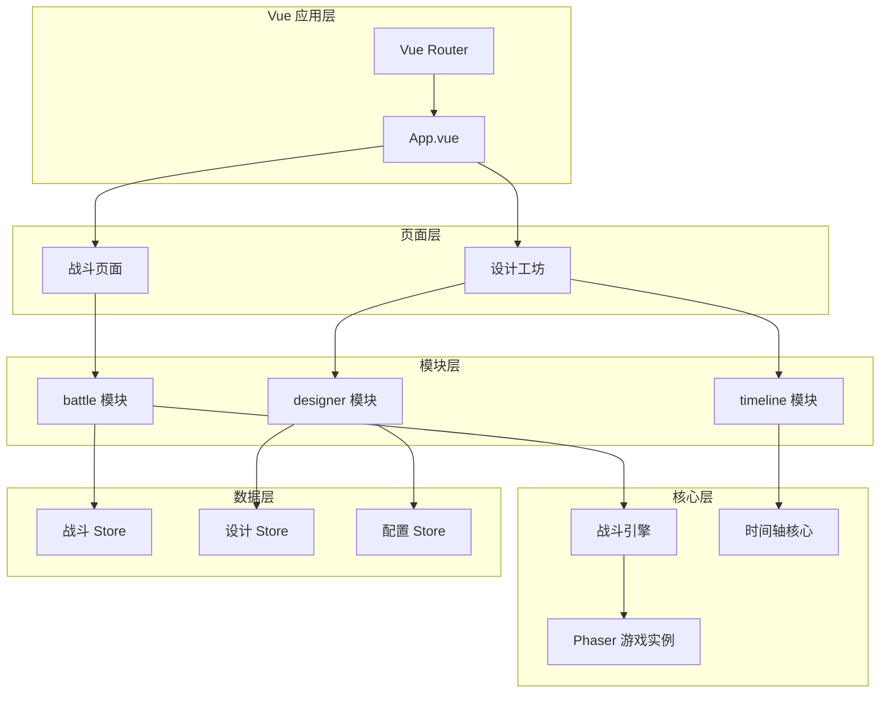
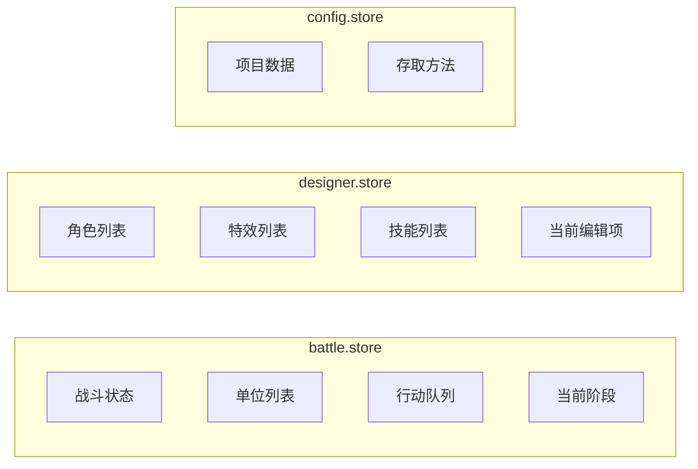

# 设计文档

## 概述

本设计文档描述回合制战斗游戏系统的技术架构和实现方案。系统基于 Vue 3 + TypeScript + Phaser 3 构建，采用模块化架构，将战斗逻辑、设计工坊和时间轴编辑器分离为独立模块。

### 技术选型

| 领域 | 技术方案 | 说明 |
|------|----------|------|
| 前端框架 | Vue 3 + TypeScript | 组合式 API，类型安全 |
| 游戏引擎 | Phaser 3 | 2D 游戏渲染，动画系统 |
| 状态管理 | Pinia | 响应式状态，模块化 Store |
| 样式方案 | Tailwind CSS v4 | 原子化 CSS |
| 工具库 | @vueuse/core, lodash-es | 组合式工具集 |

## 架构

### 整体架构图



### 目录结构

```
src/
├── modules/
│   ├── battle/                    # 战斗模块
│   │   ├── components/
│   │   │   ├── BattleCanvas.vue   # Phaser 画布容器
│   │   │   ├── BattleMenu.vue     # 操作菜单
│   │   │   ├── ActionQueue.vue    # 行动队列显示
│   │   │   └── BattleHUD.vue      # 战斗 UI 层
│   │   ├── composables/
│   │   │   ├── useBattle.ts       # 战斗流程控制
│   │   │   └── useActionQueue.ts  # 行动队列管理
│   │   ├── core/
│   │   │   ├── BattleScene.ts     # Phaser 战斗场景
│   │   │   ├── Unit.ts            # 战斗单位类
│   │   │   ├── ActionExecutor.ts  # 行动执行器
│   │   │   └── DamageCalculator.ts# 伤害计算器
│   │   ├── pages/
│   │   │   └── BattlePage.vue     # 战斗页面
│   │   └── index.ts
│   │
│   ├── designer/                  # 设计工坊模块
│   │   ├── components/
│   │   │   ├── SpriteEditor.vue   # 雪碧图编辑器
│   │   │   ├── AnimationPreview.vue# 动画预览
│   │   │   ├── CharacterPanel.vue # 角色编辑面板
│   │   │   ├── EffectPanel.vue    # 特效编辑面板
│   │   │   └── JsonPanel.vue      # JSON 配置面板
│   │   ├── composables/
│   │   │   ├── useSpriteSheet.ts  # 雪碧图解析
│   │   │   └── useDesigner.ts     # 设计器状态
│   │   ├── pages/
│   │   │   ├── DesignerPage.vue   # 设计工坊主页
│   │   │   ├── CharacterTab.vue   # 角色标签页
│   │   │   ├── EffectTab.vue      # 特效标签页
│   │   │   └── JsonTab.vue        # JSON 标签页
│   │   └── index.ts
│   │
│   └── timeline/                  # 时间轴模块
│       ├── components/
│       │   ├── Timeline.vue       # 时间轴主组件
│       │   ├── TimelineTrack.vue  # 轨道组件
│       │   ├── TimelineSegment.vue# 片段组件
│       │   ├── TimelineRuler.vue  # 时间刻度尺
│       │   └── StepEditor.vue     # 步骤编辑器
│       ├── composables/
│       │   ├── useTimeline.ts     # 时间轴核心逻辑
│       │   ├── useDragDrop.ts     # 拖拽逻辑
│       │   └── usePreview.ts      # 预览播放
│       ├── core/
│       │   ├── TimelineEngine.ts  # 时间轴引擎
│       │   └── StepExecutor.ts    # 步骤执行器
│       └── index.ts
│
├── stores/
│   ├── battle.store.ts            # 战斗状态
│   ├── designer.store.ts          # 设计器状态
│   └── config.store.ts            # 配置数据
│
├── types/
│   └── index.ts                   # 类型定义
│
└── router/
    └── index.ts                   # 路由配置
```

## 组件与接口

### 核心类型定义

```typescript
// ============ 战斗系统类型 ============

/** 战斗单位属性 */
interface UnitStats {
  hp: number;
  maxHp: number;
  mp: number;
  maxMp: number;
  speed: number;
  luck: number;
  attack: number;
  defense: number;
}

/** 战斗单位配置 */
interface UnitConfig {
  id: string;
  name: string;
  isPlayer: boolean;
  position: { row: number; col: number };
  stats: UnitStats;
  spriteConfig: SpriteConfig;
  animations: Record<string, AnimationConfig>;
}

/** 行动类型 */
type ActionType = 'attack' | 'skill' | 'item' | 'defend' | 'escape' | 'summon';

/** 战斗行动 */
interface BattleAction {
  id: string;
  type: ActionType;
  actorId: string;
  targetIds: string[];
  skillId?: string;
  itemId?: string;
  priority: number; // speed + luck
}

/** 战斗状态 */
type BattlePhase = 'init' | 'command' | 'execute' | 'result';

// ============ 设计工坊类型 ============

/** 雪碧图配置 */
interface SpriteConfig {
  url: string;
  rows: number;
  cols: number;
  frameCount?: number;
  fps?: number;
  scale?: number;
}

/** 动画配置 */
interface AnimationConfig {
  key: string;
  frames: number[];
  fps: number;
  repeat: number; // -1 为循环
}

/** 角色配置 */
interface CharacterConfig {
  id: string;
  name: string;
  sprite: SpriteConfig;
  animations: AnimationConfig[];
}

/** 特效配置 */
interface EffectConfig {
  id: string;
  name: string;
  sprite: SpriteConfig;
  animations: AnimationConfig[];
  blendMode?: string;
}

// ============ 时间轴类型 ============

/** 步骤类型 */
type StepType = 'move' | 'damage' | 'effect' | 'wait' | 'camera' | 'shake' | 'background';

/** 步骤参数 */
interface StepParams {
  // 移动步骤
  targetX?: number | string;
  targetY?: number | string;
  duration?: number;
  ease?: string;
  
  // 伤害步骤
  value?: number | string;
  
  // 特效步骤
  effectId?: string;
  x?: number | string;
  y?: number | string;
  
  // 等待步骤
  delay?: number;
  
  // 镜头步骤
  zoom?: number;
  offsetX?: number;
  offsetY?: number;
  
  // 震动步骤
  intensity?: number;
  
  // 背景步骤
  color?: string;
  image?: string;
}

/** 技能步骤 */
interface SkillStep {
  id: string;
  type: StepType;
  params: StepParams;
}

/** 时间轴片段 */
interface TimelineSegment {
  id: string;
  stepId: string;
  trackId: string;
  startFrame: number;
  endFrame: number;
}

/** 时间轴轨道 */
interface TimelineTrack {
  id: string;
  name: string;
  locked: boolean;
  hidden: boolean;
}

/** 技能设计 */
interface SkillDesign {
  id: string;
  name: string;
  steps: SkillStep[];
  segments: TimelineSegment[];
  tracks: TimelineTrack[];
  totalFrames: number;
  fps: number;
}

// ============ 配置导出类型 ============

/** 项目配置 */
interface ProjectConfig {
  version: string;
  characters: CharacterConfig[];
  effects: EffectConfig[];
  skills: SkillDesign[];
}
```

### 战斗场景类

```typescript
class BattleScene extends Phaser.Scene {
  private units: Map<string, Unit> = new Map();
  private actionQueue: BattleAction[] = [];
  private currentPhase: BattlePhase = 'init';
  
  // 初始化场景
  create(): void;
  
  // 加载单位
  loadUnits(configs: UnitConfig[]): void;
  
  // 设置行动队列
  setActionQueue(actions: BattleAction[]): void;
  
  // 执行下一个行动
  executeNextAction(): Promise<void>;
  
  // 播放单位动画
  playUnitAnimation(unitId: string, animKey: string): void;
  
  // 显示伤害数字
  showDamageNumber(unitId: string, value: number): void;
  
  // 播放特效
  playEffect(effectId: string, x: number, y: number): Promise<void>;
}
```

### 时间轴核心 Hook

```typescript
interface UseTimelineOptions {
  fps: Ref<number>;
  totalFrames: Ref<number>;
  segments: Ref<TimelineSegment[]>;
  tracks: Ref<TimelineTrack[]>;
}

interface UseTimelineReturn {
  // 状态
  currentFrame: Ref<number>;
  zoom: Ref<number>;
  isPlaying: Ref<boolean>;
  selectedSegmentId: Ref<string | null>;
  
  // 计算属性
  currentTime: ComputedRef<number>;
  totalDuration: ComputedRef<number>;
  
  // 方法
  play(): void;
  pause(): void;
  seekTo(frame: number): void;
  addTrack(): void;
  removeTrack(trackId: string): void;
  addSegment(step: SkillStep, trackId: string, startFrame: number): void;
  updateSegment(segmentId: string, startFrame: number, endFrame: number): void;
  removeSegment(segmentId: string): void;
  
  // 工具方法
  timeToPx(time: number): number;
  pxToTime(px: number): number;
  frameToTime(frame: number): number;
  timeToFrame(time: number): number;
}

function useTimeline(options: UseTimelineOptions): UseTimelineReturn;
```

## 数据模型

### 状态管理



### Pinia Store 设计

```typescript
// battle.store.ts
export const useBattleStore = defineStore('battle', () => {
  // 状态
  const phase = ref<BattlePhase>('init');
  const units = ref<UnitConfig[]>([]);
  const actionQueue = ref<BattleAction[]>([]);
  const currentActorIndex = ref(0);
  const commandTimer = ref(60);
  
  // 计算属性
  const playerUnits = computed(() => units.value.filter(u => u.isPlayer));
  const enemyUnits = computed(() => units.value.filter(u => !u.isPlayer));
  const currentActor = computed(() => playerUnits.value[currentActorIndex.value]);
  
  // 方法
  function startBattle(config: BattleConfig): void;
  function submitAction(action: BattleAction): void;
  function nextActor(): void;
  function startExecutePhase(): void;
  function endBattle(result: 'win' | 'lose' | 'escape'): void;
  
  return { phase, units, actionQueue, playerUnits, enemyUnits, currentActor, ... };
});

// designer.store.ts
export const useDesignerStore = defineStore('designer', () => {
  const characters = ref<CharacterConfig[]>([]);
  const effects = ref<EffectConfig[]>([]);
  const skills = ref<SkillDesign[]>([]);
  const currentTab = ref<'character' | 'effect' | 'skill' | 'json'>('character');
  
  function addCharacter(config: CharacterConfig): void;
  function updateCharacter(id: string, config: Partial<CharacterConfig>): void;
  function removeCharacter(id: string): void;
  // ... 类似的特效和技能方法
  
  return { characters, effects, skills, currentTab, ... };
});

// config.store.ts
export const useConfigStore = defineStore('config', () => {
  const projectName = ref('未命名项目');
  const version = ref('1.0.0');
  
  function exportConfig(): ProjectConfig;
  function importConfig(config: ProjectConfig): void;
  function saveToLocalStorage(): void;
  function loadFromLocalStorage(): void;
  
  return { projectName, version, exportConfig, importConfig, ... };
});
```

## 正确性属性

*正确性属性是系统应当满足的形式化规范，用于验证实现的正确性。每个属性都是一个普遍量化的陈述，描述了在所有有效输入下系统应有的行为。*


### Property 1: 单位阵营位置正确性

*For any* 战斗场景中的单位列表，所有玩家单位的 x 坐标应小于画布中心点，所有敌方单位的 x 坐标应大于画布中心点。

**Validates: Requirements 1.1, 1.2**

### Property 2: 行动队列排序正确性

*For any* 行动队列，队列中的行动应按照执行者的（速度 + 幸运）值降序排列。即对于队列中任意相邻的两个行动 A 和 B（A 在 B 之前），A 的执行者的（速度 + 幸运）应大于等于 B 的执行者的（速度 + 幸运）。

**Validates: Requirements 3.1, 3.2**

### Property 3: 角色激活顺序正确性

*For any* 操作阶段中的玩家角色列表，角色的激活顺序应与其在阵营中的位置顺序（从上到下，即 y 坐标从小到大）一致。

**Validates: Requirements 2.1**

### Property 4: 召唤数量限制

*For any* 战斗中的玩家阵营，执行召唤操作后，玩家阵营的角色总数不应超过 6 个。

**Validates: Requirements 2.9**

### Property 5: 死亡状态不变量

*For any* 战斗单位，当其生命值小于等于 0 时，该单位应被标记为不可行动状态，且不应出现在后续回合的可操作角色列表中。

**Validates: Requirements 3.6**

### Property 6: 胜负判定正确性

*For any* 战斗状态，当一方阵营的所有单位生命值均小于等于 0 时，战斗应结束并判定另一方获胜。

**Validates: Requirements 3.7, 3.8, 3.9**

### Property 7: 雪碧图帧切割正确性

*For any* 雪碧图配置（行数 rows，列数 cols），切割后生成的帧序列长度应等于 rows × cols（或指定的 frameCount）。

**Validates: Requirements 4.2**

### Property 8: 配置数据往返一致性

*For any* 有效的 ProjectConfig 对象，将其序列化为 JSON 字符串后再反序列化，应产生与原对象深度相等的配置对象。

**Validates: Requirements 6.5, 10.4**

### Property 9: 时间轴轨道不重叠约束

*For any* 时间轴轨道中的片段列表，任意两个片段的时间范围不应重叠。即对于片段 A 和 B，应满足 A.endFrame ≤ B.startFrame 或 B.endFrame ≤ A.startFrame。

**Validates: Requirements 7.7**

### Property 10: 片段时间更新正确性

*For any* 时间轴片段的拖拽或缩放操作，操作后片段的 startFrame 和 endFrame 应正确反映用户的操作意图，且 endFrame 应始终大于 startFrame。

**Validates: Requirements 7.4, 7.5**

### Property 11: 吸附逻辑正确性

*For any* 时间轴片段移动操作，当片段边缘与其他片段边缘或时间指示器的距离小于吸附阈值时，片段应自动对齐到最近的吸附点。

**Validates: Requirements 7.6**

### Property 12: 时间轴缩放正确性

*For any* 时间轴缩放操作，缩放后时间轴的显示比例应在允许的最小值和最大值范围内，且鼠标位置对应的时间点应保持不变（锚点缩放）。

**Validates: Requirements 9.8**

### Property 13: 预览播放同步正确性

*For any* 预览播放过程，时间指示器的位置应与当前播放时间保持同步，即 indicatorPosition = currentTime × zoom。

**Validates: Requirements 9.2, 9.3**

### Property 14: 数据验证正确性

*For any* 导入的配置数据，如果数据格式不符合 ProjectConfig 的类型定义，系统应拒绝导入并返回具体的错误信息。

**Validates: Requirements 6.3, 10.5**

## 错误处理

### 错误类型定义

```typescript
/** 错误类型枚举 */
enum ErrorType {
  INVALID_CONFIG = 'INVALID_CONFIG',
  RESOURCE_LOAD_FAILED = 'RESOURCE_LOAD_FAILED',
  INVALID_OPERATION = 'INVALID_OPERATION',
  STORAGE_ERROR = 'STORAGE_ERROR',
}

/** 应用错误类 */
class AppError extends Error {
  constructor(
    public type: ErrorType,
    message: string,
    public details?: Record<string, unknown>
  ) {
    super(message);
  }
}
```

### 错误处理策略

| 场景 | 处理方式 |
|------|----------|
| 雪碧图加载失败 | 显示占位图，记录警告日志 |
| 配置数据无效 | 拒绝导入，显示错误详情 |
| localStorage 不可用 | 降级为内存存储，提示用户 |
| Phaser 初始化失败 | 显示错误页面，提供重试选项 |
| 时间轴操作冲突 | 回滚操作，显示提示信息 |

## 测试策略

### 单元测试

使用 Vitest 进行单元测试，重点覆盖：

- 伤害计算逻辑
- 行动队列排序算法
- 雪碧图帧切割算法
- 配置数据序列化/反序列化
- 时间轴片段碰撞检测

### 属性测试

使用 fast-check 进行属性测试，每个属性测试至少运行 100 次迭代：

```typescript
import * as fc from 'fast-check';

// Property 2: 行动队列排序
describe('Action Queue Sorting', () => {
  it('should sort actions by (speed + luck) in descending order', () => {
    fc.assert(
      fc.property(
        fc.array(fc.record({
          id: fc.string(),
          actorId: fc.string(),
          speed: fc.integer({ min: 1, max: 100 }),
          luck: fc.integer({ min: 1, max: 100 }),
        })),
        (actions) => {
          const sorted = sortActionQueue(actions);
          for (let i = 0; i < sorted.length - 1; i++) {
            const a = sorted[i];
            const b = sorted[i + 1];
            expect(a.speed + a.luck).toBeGreaterThanOrEqual(b.speed + b.luck);
          }
        }
      ),
      { numRuns: 100 }
    );
  });
});

// Property 8: 配置往返一致性
describe('Config Round Trip', () => {
  it('should preserve config after serialize/deserialize', () => {
    fc.assert(
      fc.property(
        arbitraryProjectConfig(),
        (config) => {
          const json = JSON.stringify(config);
          const restored = JSON.parse(json);
          expect(restored).toEqual(config);
        }
      ),
      { numRuns: 100 }
    );
  });
});

// Property 9: 轨道不重叠
describe('Timeline Track Non-Overlap', () => {
  it('should prevent overlapping segments on same track', () => {
    fc.assert(
      fc.property(
        fc.array(arbitrarySegment()),
        (segments) => {
          const validated = validateTrackSegments(segments);
          for (let i = 0; i < validated.length; i++) {
            for (let j = i + 1; j < validated.length; j++) {
              const a = validated[i];
              const b = validated[j];
              if (a.trackId === b.trackId) {
                expect(a.endFrame <= b.startFrame || b.endFrame <= a.startFrame).toBe(true);
              }
            }
          }
        }
      ),
      { numRuns: 100 }
    );
  });
});
```

### 测试文件组织

```
src/
├── modules/
│   ├── battle/
│   │   ├── core/
│   │   │   ├── DamageCalculator.ts
│   │   │   └── DamageCalculator.test.ts
│   │   └── composables/
│   │       ├── useActionQueue.ts
│   │       └── useActionQueue.test.ts
│   ├── designer/
│   │   └── composables/
│   │       ├── useSpriteSheet.ts
│   │       └── useSpriteSheet.test.ts
│   └── timeline/
│       └── composables/
│           ├── useTimeline.ts
│           └── useTimeline.test.ts
└── stores/
    ├── config.store.ts
    └── config.store.test.ts
```
